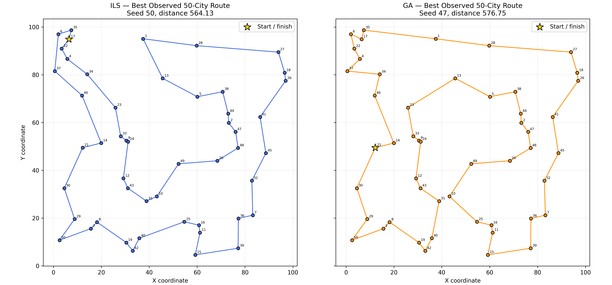
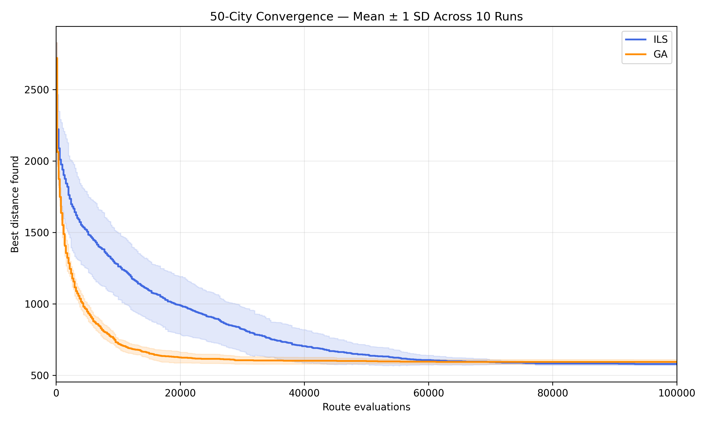

# AI for Search and Optimisation

## Travelling Salesman Problem: Iterated Local Search vs Genetic Algorithm

**Author:** Yaseen Sharaf  
**Module:** AI for Search and Optimisation

A Python project comparing **Iterated Local Search (ILS)** and a **Genetic Algorithm (GA)** on the symmetric Euclidean Travelling Salesman Problem (TSP). The study examines solution quality, convergence, runtime and consistency across five problem sizes, using the same route-evaluation budget for both algorithms.

The complete implementation, experiments, visualisations and discussion are contained in [coursework.ipynb](coursework.ipynb). An accompanying [evaluation report](Evaluation_Report.docx) and [saved experimental results](Results/experiment_20260915_113404_325433) are also included.

## Research Question

How effectively do Iterated Local Search and Genetic Algorithms solve the Travelling Salesman Problem as problem size increases from 10 to 50 cities, considering solution quality, convergence, computational efficiency and robustness?

## Problem and Dataset

The objective is to find a short closed route that visits every selected city exactly once and returns to the starting city.

The dataset, [Dataset/cities.csv](Dataset/cities.csv), contains 50 cities with three columns:

| Column | Description |
| --- | --- |
| `City` | Unique city identifier |
| `X` | X coordinate |
| `Y` | Y coordinate |

Distances are calculated using straight-line Euclidean distance. Results are reported in **coordinate units**, because the dataset does not specify a physical unit such as kilometres.

Five instances use the **first 10, 20, 30, 40 and 50 rows in the original dataset order**. Each instance is solved separately, and both algorithms receive the same coordinates and distance matrix.

## Algorithms

### Iterated Local Search (ILS)

ILS improves one incumbent route through repeated local search and perturbation:

1. Generate a random permutation of the selected cities.
2. Apply **first-improvement 2-opt**, reversing route segments and accepting the first improvement found.
3. Perturb the incumbent by swapping **two disjoint pairs of cities**, preserving the starting position.
4. Apply 2-opt to the perturbed route.
5. Replace the incumbent only when the candidate is shorter.
6. Continue until the evaluation budget is exhausted.

The main experiment uses `iterated_local_search_budgeted()`. The budget can interrupt a local search before it reaches a local optimum. The notebook also includes an introductory iteration-based ILS implementation.

### Genetic Algorithm (GA)

GA evolves a population of candidate routes through selection, crossover and mutation:

| Component | Configuration |
| --- | --- |
| Population | 50 randomly initialised routes |
| Parent selection | Tournament selection with 3 candidates |
| Crossover | Order crossover, preserving valid city permutations |
| Mutation | Inversion mutation with probability 0.2 per offspring |
| Elitism | Preserve one best route between generations |
| Stopping condition | Exhaust the route-evaluation budget |

The implementation is provided by `genetic_algorithm()`. The elite route retains its previously calculated distance, while each new offspring receives a complete route evaluation.

## Experimental Design

| Setting | Value |
| --- | --- |
| Problem sizes | 10, 20, 30, 40 and 50 cities |
| Runs per algorithm and size | 10 |
| Main experiment seeds | 42–51 |
| Total main experiment runs | 100 |
| Budget per run | 100,000 complete route-distance evaluations |
| Pilot | 50 cities; seeds 142–144 |
| Pilot checkpoints | 10,000, 50,000 and 100,000 evaluations |
| Runtime measurement | `time.perf_counter()` |
| Recorded outcomes | Best distance, runtime, evaluations, final route and convergence history |

Initial solutions and rejected candidates count toward the budget. Both algorithms stop at exactly 100,000 evaluations in every main experiment run. Execution order alternates to reduce a consistent ordering effect.

The pilot informed the choice of budget: 50,000 evaluations interrupted the initial ILS local search in two of the three pilot runs. At 100,000 evaluations, all three had budget available for perturbation and further local search.

Runtime includes algorithm initialisation, search and convergence-history recording. It excludes distance-matrix construction, result validation, plotting and file saving. Equal evaluation counts therefore do not imply equal runtime or computational effort.

## Results

The following values come from the [saved summary statistics](Results/experiment_20260915_113404_325433/summary_statistics.csv). Distances show **mean ± sample standard deviation across 10 runs**. Lower distance is better.

| Cities | ILS distance | GA distance | ILS mean runtime (s) | GA mean runtime (s) |
| --- | ---: | ---: | ---: | ---: |
| 10 | 290.31 ± 0.00 | 290.31 ± 0.00 | 1.081 | 10.333 |
| 20 | 386.43 ± 0.00 | 391.72 ± 16.32 | 2.669 | 13.929 |
| 30 | 451.77 ± 0.00 | 459.15 ± 9.31 | 3.392 | 14.776 |
| 40 | 500.30 ± 11.75 | 523.84 ± 28.14 | 3.585 | 14.986 |
| 50 | 579.70 ± 9.16 | 594.57 ± 15.99 | 4.198 | 15.358 |

Values are rounded for display. Runtime measurements describe the recorded execution environment and will vary on other machines.

### Main Findings

- Both algorithms achieved the same mean distance on the 10-city instance.
- ILS achieved lower mean distances at 20–50 cities, with reductions relative to GA of approximately **1.35%, 1.61%, 4.50% and 2.50%**, respectively.
- ILS showed lower variation across seeds on the 20–50-city instances.
- ILS had lower measured mean runtime at every size; GA took approximately **3.66–9.56 times as long**.
- On the 50-city instance, GA improved more quickly early in the evaluation budget, while ILS reached a lower final mean distance.
- The best observed 50-city distances were **564.13 for ILS** and **576.75 for GA**. No certified optimum was used.

### Best Observed 50-City Routes



### Convergence Across 10 Runs



Additional [figures](Results/experiment_20260915_113404_325433/figures) compare mean distance, runtime and the distribution of 50-city results. Each is available as PNG and PDF.

## Statistical Analysis

Final distances are compared at each problem size using two-sided **Welch's t-tests**, **Mann–Whitney U tests** and an **exact paired permutation sensitivity analysis**. Holm correction is applied across all 15 planned comparisons, with a significance threshold of 0.05.

After correction, only the Mann–Whitney comparisons at 20 and 30 cities reject their null hypotheses, with adjusted p-values of approximately **0.0274** and **0.0303**. No Welch or paired permutation comparison rejects its null hypothesis. The 10-city Welch test is undefined because both samples have zero variation after the rounding used for testing.

Seeds are reused across algorithms, so the independent-sample tests are exploratory. The paired analysis preserves seed pairing but still relies on exchangeability under its null hypothesis. The descriptive results favour ILS under these settings; the statistical evidence does not establish a consistent advantage across tests.

See [statistical_tests.csv](Results/experiment_20260915_113404_325433/statistical_tests.csv) for the complete results.

## Installation and Usage

Use **Python 3.11** and Jupyter Notebook. The experiment recorded Python 3.11.2. Required scientific libraries are NumPy, pandas, Matplotlib and SciPy.

### 1. Clone the Repository

```bash
git clone https://github.com/yaseensharaf/AI-for-Search-and-Optimisation.git
cd AI-for-Search-and-Optimisation
```

### 2. Create a Virtual Environment

```bash
python -m venv .venv
```

Activate it using the command for your shell:

**Windows PowerShell:**

```powershell
.\.venv\Scripts\Activate.ps1
```

**Windows Command Prompt:**

```bat
.venv\Scripts\activate.bat
```

**macOS / Linux:**

```bash
source .venv/bin/activate
```

### 3. Install Dependencies

```bash
python -m pip install --upgrade pip
python -m pip install --upgrade numpy pandas matplotlib scipy notebook ipykernel
```

Install the packages together in the fresh environment to let pip resolve their compatibility. If a NumPy/SciPy compatibility warning appears in an existing environment, upgrade both packages in that environment and restart the notebook kernel.

### 4. Run the Notebook

```bash
python -m notebook coursework.ipynb
```

Open the notebook and run all cells from top to bottom. Keep the notebook's working directory at the repository root so that `Dataset/cities.csv` resolves correctly. The folder name is **`Dataset`**, including its capitalisation.

The full notebook executes demonstrations, a pilot and 100 main experiment runs. Each new main experiment creates a timestamped folder under `Results/`, preserving earlier experiments. Saved notebook outputs and result files can also be inspected without rerunning the search.

## Repository Contents

| Path | Purpose |
| --- | --- |
| `coursework.ipynb` | Full implementation, validation checks, experiments, plots and discussion |
| `Dataset/cities.csv` | Original 50-city coordinate dataset |
| `Evaluation_Report.docx` | Accompanying evaluation report |
| `Results/experiment_20260915_113404_325433/` | Saved experiment used for the results above |

Each complete experiment folder contains:

| File or folder | Contents |
| --- | --- |
| `cities_used.csv` | Copy of the city data used in the experiment |
| `settings.json` | Algorithm settings, seeds, budget and recorded Python/NumPy/pandas versions |
| `results.csv` | Individual run results, routes and history-file paths |
| `summary_statistics.csv` | Distance and runtime summary statistics |
| `distance_comparison.csv` | Mean-distance differences and percentage reductions |
| `runtime_comparison.csv` | Mean runtimes and GA-to-ILS runtime ratios |
| `statistical_tests.csv` | Test statistics, raw and adjusted p-values, and decisions |
| `statistical_settings.json` | Statistical analysis configuration |
| `histories/` | Compressed JSON files containing each run's route and convergence history |
| `figures/` | Result visualisations in PNG and PDF formats |

## Validation and Reproducibility

The notebook includes assertions for dataset integrity, distance-matrix symmetry, a known square-tour distance, valid city permutations, operator behaviour, seeded reproducibility, evaluation-budget compliance and saved-result consistency. It verifies that the main experiment contains 100 unique algorithm–size–seed combinations.

Seeds, input data and algorithm settings support repeatable experiments. The saved environment metadata is partial, so identical outputs across different software environments are not guaranteed.

## Limitations and Future Work

The study uses one fixed instance per size, all drawn from the same dataset, and ten runs per algorithm and size. Neither algorithm received extensive parameter tuning, and no exact solver or certified optimum was used. The conclusions therefore apply to the tested implementations, instances and evaluation budget.

Future work could evaluate more independent datasets and seeds, compare several evaluation and time budgets, tune the algorithms systematically, and use exact solutions for smaller instances to measure optimality gaps.

The [notebook](coursework.ipynb) contains the full methodological discussion and references.
